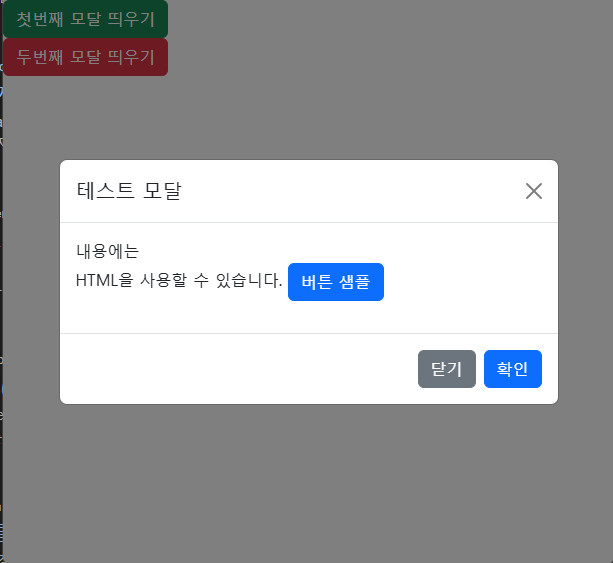
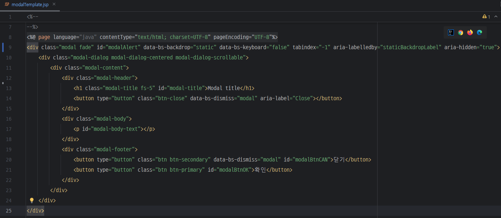
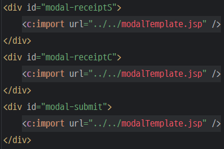
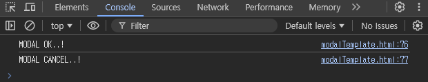

# ModalTemplate

> 공통함수화로 코드의 재사용을 최소화.

> 부트스트랩의 Modal을 이용함




## 파일
> Bootstrap은 최신버전 사용을 권장, 내장된 Bootstrap을 기반으로 만든 ModalTemplate, basicModal파일임.

1. Bootstrap 관련 js파일
2. Bootstrap 관련 css파일
3. basicModal 파일
4. 예제 HTML 파일

## 구현기능
- Modal을 쉽게 사용
    - Modal은 가운데, `닫기`혹은 `확인`버튼을 눌러야 닫히는 Modal임.

## 사용 순서
0. `HTML`에 Modal을 사용할 개수만큼 생성
    - `ModalTemplate` 을 따로 만들어 `jsp`로 불러오는것을 추천 (예시)
        - 선언

            

        - 사용

            

1. JS로 Modal을 생성할 객체에 `$.extend(true, <TARGET>, basicModal)`으로 덮어씌워 사용
2. `init`으로 제목, 내용, 확인/닫기 버튼을 눌렀을경우 콜백함수 정의
3. `<TARGET>.alert()`으로 Modal 띄우기

## Modal의 옵션들
> 공통 Modal의 기본 옵션을 변경하려면 `basicModal`, `modalTemplate`에서 기본 속성을 변경할 수 있음.

🔍[Bootstrap Modal Docs](https://getbootstrap.kr/docs/5.3/components/modal/)

## 문제점
- 단순 알림창을 띄우는것을 목적으로 만들었기 때문에 내용에 특정 컨텐츠가 들어가는것은 확인이 필요함.
- 모달위에 모달은 띄울 수 없음

## 응용 및 용도
- 쉬운사용(?)

## 단순 예시
1. Modal HTML 선언
    ```HTML
    <div id="modalParentTag"> 
            <!-- modal태그 하위 내용을 jsp로 따로만들고, c:import 시켜서 탬플릿화 시키기. -->
            <!-- ModalTemplate.jsp -->
                <div class="modal fade" id="modalAlert" data-bs-backdrop="static" data-bs-keyboard="false" tabindex="-1" aria-labelledby="staticBackdropLabel" aria-hidden="true">
                    <div class="modal-dialog modal-dialog-centered modal-dialog-scrollable">
                        <div class="modal-content">
                            <div class="modal-header">
                                <h1 class="modal-title fs-5" id="modal-title">Modal title</h1>
                                <button type="button" class="btn-close" data-bs-dismiss="modal" aria-label="Close"></button>
                            </div>
                            <div class="modal-body">
                                <p id="modal-body-text"></p>
                            </div>
                            <div class="modal-footer">
                                <button type="button" class="btn btn-secondary" data-bs-dismiss="modal" id="modalBtnCAN">닫기</button>
                                <button type="button" class="btn btn-primary" id="modalBtnOK">확인</button>
                            </div>
                        </div>
                    </div>
                </div>
            <!-- ModalTemplate.jsp END -->
        </div>
    ```
2. JavaScript Modal 선언
    ```JavaScript
    var testModal = {
        modal : {},
        init : function(){
            $.extend(true, this.modal, basicModal);
            this.modal.init(
                "#modalParentTag",
                "테스트 모달",
                "내용에는<br>HTML을 사용할 수 있습니다. <button class='btn btn-primary'>버튼 샘플</button>",
                [function(){console.log("MODAL OK..!")}],
                [function(){console.log("MODAL CANCEL..!")}]
            )
        }
    }
    ```
3. 예시) 페이지 로드되자마자 모달 띄우기
    ```JavaScript
    $(document).ready(function(){
        testModal.init();
        testModal.modal.alert();
    });
    ```
- 결과

    

## BOOTSTRAP LICENSE
```
The MIT License (MIT)

Copyright (c) 2011-2024 The Bootstrap Authors

Permission is hereby granted, free of charge, to any person obtaining a copy
of this software and associated documentation files (the "Software"), to deal
in the Software without restriction, including without limitation the rights
to use, copy, modify, merge, publish, distribute, sublicense, and/or sell
copies of the Software, and to permit persons to whom the Software is
furnished to do so, subject to the following conditions:

The above copyright notice and this permission notice shall be included in
all copies or substantial portions of the Software.

THE SOFTWARE IS PROVIDED "AS IS", WITHOUT WARRANTY OF ANY KIND, EXPRESS OR
IMPLIED, INCLUDING BUT NOT LIMITED TO THE WARRANTIES OF MERCHANTABILITY,
FITNESS FOR A PARTICULAR PURPOSE AND NONINFRINGEMENT. IN NO EVENT SHALL THE
AUTHORS OR COPYRIGHT HOLDERS BE LIABLE FOR ANY CLAIM, DAMAGES OR OTHER
LIABILITY, WHETHER IN AN ACTION OF CONTRACT, TORT OR OTHERWISE, ARISING FROM,
OUT OF OR IN CONNECTION WITH THE SOFTWARE OR THE USE OR OTHER DEALINGS IN
THE SOFTWARE.
```